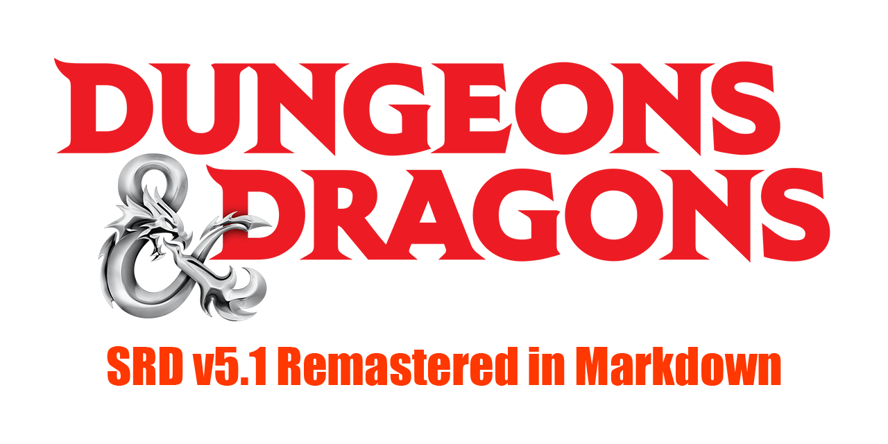

# OGL-SRD5

## Welcome to the online Dungeons & Dragons 5th Edition System Reference Document (SRD) v5.1 Remastered in Markdown Format!

---

**Powerful SRD search** of this material available via the project's official website at: [www.ogl-srd5.com](http://ogl-srd5.com)

**The Systems Reference Document (SRD)** contains guidelines for publishing content under the Open-Gaming License (OGL). The [Dungeon Masters Guild](http://dungeonmastersguild.com/) also provides self-publishing opportunities for individuals and groups. The OGL and Dungeon Masters Guild offer different kinds of publishing opportunities. For an overview of the programs, please visit the official [Wizards SRD page](http://dnd.wizards.com/articles/features/systems-reference-document-srd).

**Why Markdown format?** Markdown is a lightweight markup language with plain text formatting syntax created by [John Gruber](https://daringfireball.net). It is designed so that it can be converted to HTML and many other formats using any number of various Markdown editors. Markdown is often used to format readme files, for writing books, blogs and messages, or to simply create rich text using a plain text editor.

**The "Pages" Contained Herein** were exported directly from the official SRD PDF (see below), but have been fully re-edited into Markdown for improved organization, portability and conversions to other formats. This is not a basic conversion as you find elsewhere, we have painstakingly remastered the original Wizard's SRD PDF to markdown format paragraph-by-paragraph. Please report any issues you find through this GitHub account. Thank you!

#### Downloads

* View the remastered [SRD v5.1 raw data in Mardown format (full compilation)](https://raw.githubusercontent.com/Umbyology/OGL-SRD5/master/D%26D%205E%20SRD%20v5.1%20Compilation.md).
* Download the remastered [SRD v5.1 in Markdown format (full compilation)](https://github.com/Umbyology/OGL-SRD5/archive/master.zip).
* Download the official [SRD v5.1 in PDF format](http://media.wizards.com/2016/downloads/DND/SRD-OGL_V5.1.pdf)
* Download the official [Errata and FREE Basic Rules](http://dnd.wizards.com/articles/features/basicrules).
* Download the official [Characters Sheets](http://dnd.wizards.com/articles/features/character_sheets).

© 2015 Wizards. All Rights Reserved. Dungeons & Dragons® is a trademark[s] of Wizards of the Coast. For more information about Wizards of the Coast or any of Wizards' trademarks or other intellectual property, please visit their website at [www.wizards.com](http://www.wizards.com).

Website and markdown conversion by [B.A. Umberger](http://www.umbyology.com) in cooperation with [Juxtagames, LLC](http://www.juxta.games). By permission, this website utilizes official material and images from the [Wizard's Fan Site Kit](http://dnd.wizards.com/articles/features/fan-site-kit). Wizards of the Coast, Dungeons & Dragons, and their logos are trademarks of Wizards of the Coast LLC in the United States and other countries.
