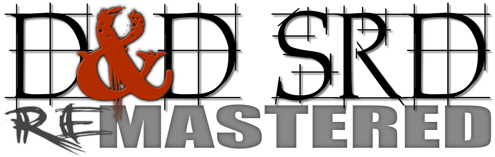

# WARNING: We Are Currently Updating to REmastered v4.1 (see Formats) Now Thru The Weekend; Please Visit Us Again On Monday!

---

#### Welcome to the online Dungeons & Dragons 5th Edition System Reference Document (Wizards SRD v5.1 w/Errata) REmastered in Markdown & Microsoft Word Formats!

---

**The Systems Reference Document (SRD)** contains guidelines for publishing content under the Open-Gaming License (OGL). The [Dungeon Masters Guild](http://dungeonmastersguild.com/) also provides self-publishing opportunities for individuals and groups. The OGL and Dungeon Masters Guild offer different kinds of publishing opportunities. For an overview of the programs, please visit the official [Wizards SRD page](http://dnd.wizards.com/articles/features/systems-reference-document-srd) to compare the programs.

**Why Markdown format?** Markdown is a lightweight markup language with plain text formatting syntax created by [John Gruber](https://daringfireball.net). It is designed so that it can be converted to HTML and many other formats using any number of various Markdown editors. Markdown is often used to format readme files, for writing books, blogs and messages, or to simply create rich text using a plain text or markkdown editor.

The documents contained herein are edited line-by-line into Markdown format for export to other publishing formats or into your own 5E projects. We have painstakingly REmastered the original Wizard's SRD v5.1 PDF to markdown, **plus all errata from the Nov 2018 update**.

## Issues & Error Reporting

Please report any issues you find through our Github account, or make any corrections through a Github pull request.

## Downloads

* View or download the [Complete REmastered file in .PDF | .DOCX | .MD](https://github.com/Umbyology/OGL-SRD5/tree/master/formats).
* View or Download each [REmastered Markdown Page](https://github.com/Umbyology/OGL-SRD5/find/master)
* Download the official [SRD v5.1 in PDF format](http://media.wizards.com/2016/downloads/DND/SRD-OGL_V5.1.pdf)
* Download the official [Errata and FREE Basic Rules](http://dnd.wizards.com/articles/features/basicrules).
* Download the official [Characters Sheets](http://dnd.wizards.com/articles/features/character_sheets).

© 2015 Wizards. All Rights Reserved. Dungeons & Dragons® is a trademark[s] of Wizards of the Coast. For more information about Wizards of the Coast or any of Wizards' trademarks or other intellectual property, please visit their website at [www.wizards.com](http://www.wizards.com).

Website, markdown conversion and extended formats by [B.A. Umberger](http://www.umbyology.com) in cooperation with [Juxtagames, LLC](http://www.juxta.games). By permission, this website utilizes official material and images from the [Wizard's Fan Site Kit](http://dnd.wizards.com/articles/features/fan-site-kit). Wizards of the Coast, Dungeons & Dragons, and their logos are trademarks of Wizards of the Coast LLC in the United States and other countries.
