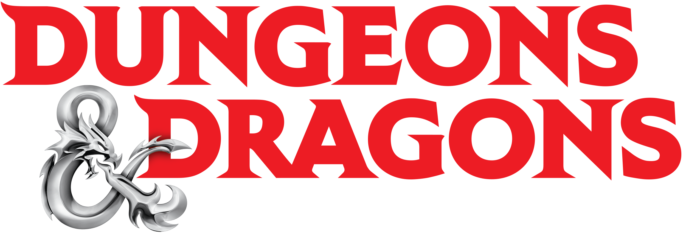
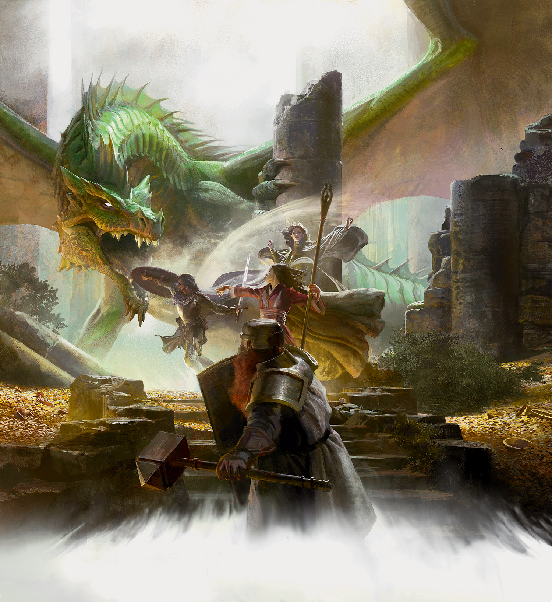
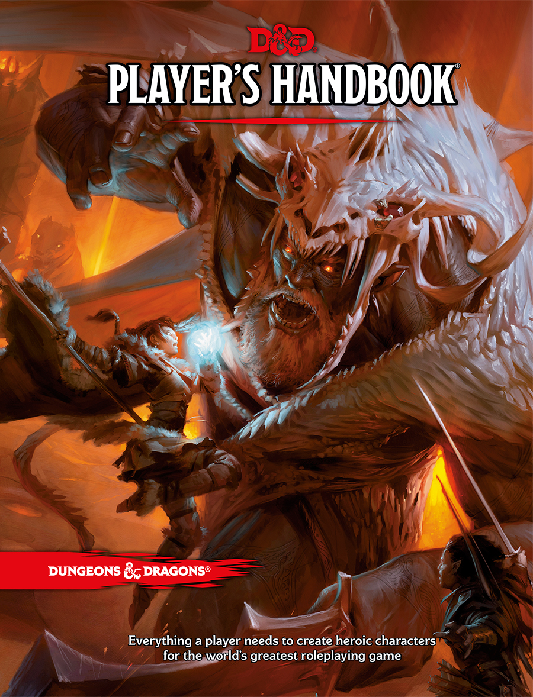
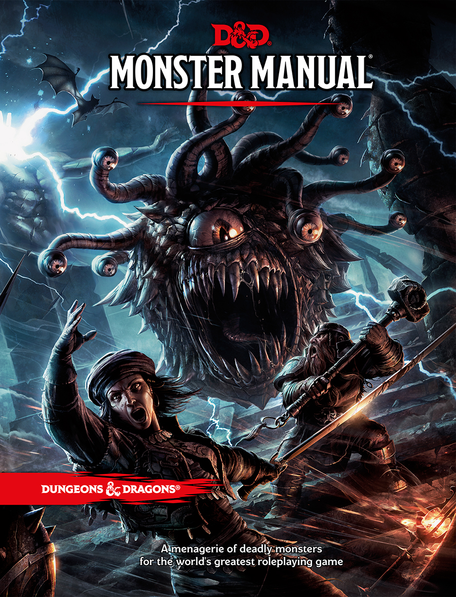

[center]Site Updated: [May 17th 2019](https://ogl-srd5.com/changelog#may-17th-2019)[/center]

#### Welcome to the online Dungeons & Dragons 5th Edition System Reference Document v5.1 in Markdown Format!

---

**The Systems Reference Document (SRD)** contains guidelines for publishing content under the Open-Gaming License (OGL). The [Dungeon Masters Guild](http://dungeonmastersguild.com/) also provides self-publishing opportunities for individuals and groups. The OGL and Dungeon Masters Guild offer different kinds of publishing opportunities. For an overview of the programs, please visit the official [Wizards SRD page](http://dnd.wizards.com/articles/features/systems-reference-document-srd).

**Why Markdown format?** Markdown is a lightweight markup language with plain text formatting syntax created by [John Gruber](https://daringfireball.net). It is designed so that it can be converted to HTML and many other formats. Markdown is often used to create readme files, for writing messages in online discussion forums, and to create rich text using a plain text editor.

! The documents contained herein are edited from scratch into Markdown format for portability and conversion to other formats. This is not a basic conversion as you find elsewhere, we have painstakingly converted the original Wizard's SRD PDF to markdown paragraph-by-paragraph. The original documents can be downloaded from our [Cry Havoc Studio GitHub repository](https://github.com/CryHavocStudio/OGL-SRD5). Please report any issues you find through our GitHub account. Thank you!

**NEW FEATURES:** Powerful search engins now available! Search the D&D 5E SRD using our standard highlight search field, or use the new _TNT Search_, an advanced full-text search, both of these search engines are located in the left-hand sidebar, or perform a [custom Google search](https://cse.google.com/cse?cx=001286843246981938841:_5jzoxwanvq) of the SRD.

[Download the official SRD v5.1 in PDF format](http://media.wizards.com/2016/downloads/DND/SRD-OGL_V5.1.pdf)

[Download the SRD v5.1 in Markdown format (compilation)](https://github.com/CryHavocStudio/OGL-SRD5/blob/master/D%26D%205E%20SRD%20v5.1%20Compilation.md)

---

#### Official Dungeons & Dragons Core Game Books

Download the official [Errata and FREE Basic Rules](http://dnd.wizards.com/articles/features/basicrules). and [Characters Sheets](http://dnd.wizards.com/articles/features/character_sheets).

| [Player's Handbook](https://www.amazon.com/Players-Handbook-Dungeons-Dragons-Wizards/dp/0786965606/ref=asap_bc?ie=UTF8) | [Dungeon Master's Guide](https://www.amazon.com/Dungeon-Masters-Guide-Core-Rulebook/dp/0786965622/ref=asap_bc?ie=UTF8) | [Monster Manual](https://www.amazon.com/Monster-Manual-Core-Rulebook-Wizards/dp/0786965614/ref=asap_bc?ie=UTF8) |
|:----------------------------------------------------------------------------------------------------------------------- |:---------------------------------------------------------------------------------------------------------------------- |:--------------------------------------------------------------------------------------------------------------- |
|                                                                                                      |                                                                                                     |                                                                                                |

Website by [Cry Havoc Studio](http://cryhavoc.studio). By permission, this website utilizes official material and images from the [Wizard's Fan Site Kit](http://dnd.wizards.com/articles/features/fan-site-kit).

Wizards of the Coast, Dungeons & Dragons, and their logos are trademarks of Wizards of the Coast LLC in the United States and other countries. © 2015 Wizards. All Rights Reserved.

Dungeons & Dragons® is a trademark[s] of Wizards of the Coast. For more information about Wizards of the Coast or any of Wizards' trademarks or other intellectual property, please visit their website at [www.wizards.com](http://www.wizards.com).
